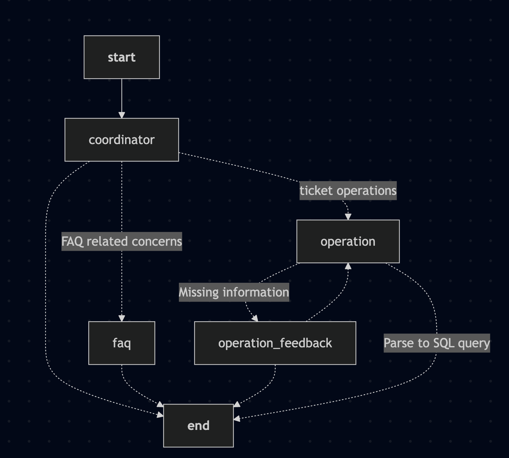
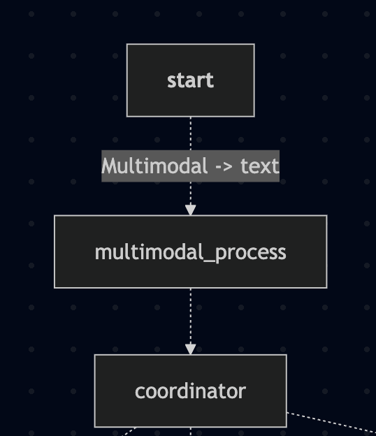
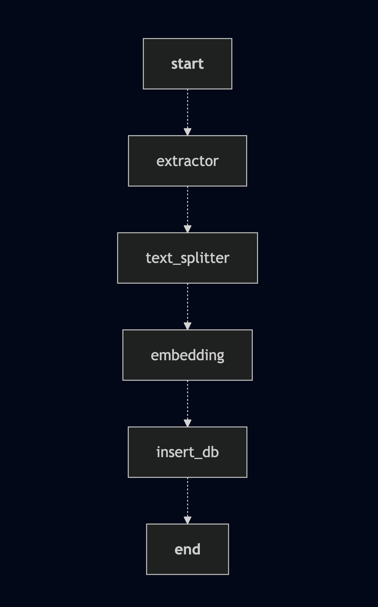

# Architecture

There are two workflows: **Chat** and **Indexing**.

- **Chat**: Routes user queries to the corresponding services (FAQ or Ticket Operation).

- **Indexing**: Takes internal policies or documents, converts them into chunks, and inserts them into the database for later FAQ usage.

## Chat Workflow

### Architecture

The overall graph is illustrated below:

**Responsibilities of each component:**

- **Coordinator**: Routes user requests to the appropriate services and handles small talk/greetings.

- **FAQ**: Powered by a RAG system, it searches for similar internal documents in the database and answers user queries.

- **Operation**: Technically should be named *after-service operation*. Responsible for parsing user queries into corresponding SQL statements.

- **Operation Feedback**: If the user query lacks necessary information, causing the **Operation** node to fail, this component gathers more information through follow-up questions. It is inspired by the Human-In-The-Loop (HITL) system.

### How to Support multimodal query

The current workflow mainly supports text-based interactions.
To handle multimodal input, create an additional node called `multimodal_processor`, which converts images or voice to text before further processing.

## Indexing Workflow

### Architecture

The indexing workflow is illustrated below:

**Responsibilities of each component:**

- **Extractor** & **Text Splitter**: Given an unstructured document, extract and convert it into chunks with metadata.

- **Embedding**: Converts text into vector representations.

- **Insert-DB**: Inserts vectors into the database. Currently, only Milvus is supported.

## Components

| Component      | Description                                                                 | Implementations                    | Tech Stack & Reasoning |
|----------------|-----------------------------------------------------------------------------|------------------------------------|-------------------------|
| chats          | Contains implementations of chat model interfaces and utilities for interacting with LLM chat models like ChatGPT | - OpenAI Chat                      | - OpenAI is a leading provider of advanced LLMs like ChatGPT. |
| embeddings     | Implements embedding models for converting text into vector representations | - OpenAI Embeddings                | - Same reasoning as OpenAI Chat. |
| extractors     | Utilities for extracting information and data from various sources           | - PDF Extractor                    | - PyMuPDF: one of the leading frameworks for PDF parsing. |
| graphs         | Implements workflow graphs and node-based systems for AI agent operations   | - Nodes & Graph for Booking Assistant | - LangGraph: supports orchestration, streaming, and async natively. |
| models         | Contains Pydantic models and schemas that define the structure of data       | - Message, Stream Event            | - Pydantic: simply the best for data validation. |
| programs       | Contains LLM programs that generate structured outputs using Pydantic models | - Booking Operations               | - OpenAI's structured output parsing. |
| storages       | Implements storage systems, including vector database integrations           | - Local Storage - Milvus        | - Milvus: a leading vector DB, supports cluster deployment, multiple indexing methods, rapid development, and strong community/tutorials. |
| text_splitters | Implements utilities to split large text documents into smaller chunks       | - LangChain Text Splitter          | - langchain-core is already included when using LangGraph. |
