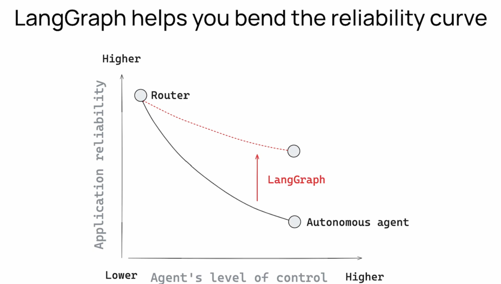
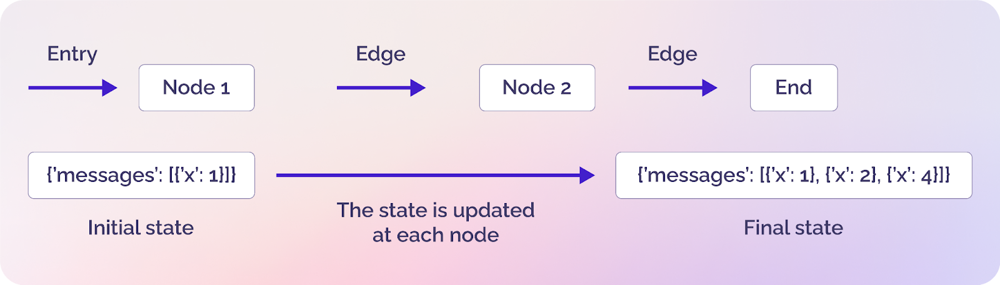

# LangGraph: Orchestration Framework for LLM Applications

## Key Concepts at a Glance

### 1. Two Core Patterns
- **🔄 Workflow Pattern**: Fixed execution path (e.g., RAG workflows)
- **🤖 Agent Pattern**: LLM-determined path (e.g., ReAct agents)


A trade-off exists between reliability and an agent's controllability.



### 2. Essential Features

- **👥 Human-in-the-Loop (HITL)**
    LangGraph supports a checkpointer to save and reload the state of each node.

    ```python
    input -> node-a -> [pause for feedback] -> [user feedback] -> [restore at the beginning of node-a] -> node-b -> end
    ```

- **⚡ Real-time Streaming**
    Supports multiple streaming methods: `values`, `updates`, `custom`, or any combination of these.

    - `updates`: Emits results after the execution of each node.
    - `values`: Emits the shared state whenever it changes.
    - `custom`: Primarily used to stream responses from an LLM provider (especially necessary when using providers other than LangChain).

- **🔌 Provider Agnostic**
    LangGraph focuses solely on orchestration. You can use any LLM provider such as LangChain, LlamaIndex, or OpenAI.

- **⚙️ Parallelization, Subgraphs, and Async Support**
    - A node can be a function or a subgraph.
    - Nodes can execute in parallel automatically.
        - If `node-a -> node-b` and `node-a -> node-c`, then `node-b` and `node-c` can run concurrently.
    - Fully asynchronous-compatible.

### 3. Building Blocks



- **Nodes**: Functions or subgraphs that define actions
- **Edges**: Define the execution flow
- **State**: Shared context passed between nodes

### 4. Demo

The script [demo.py](./demo.py) demonstrates:

- Defining a simple graph to understand the basics of `nodes - edges - state`:
    - Graph diagram
    - Difference between streaming events in `graph.astream()`

- Basic Human-in-the-Loop (HITL) support:
    - Checkpointer
    - Interrupt / Resume

- Streaming responses from a specific graph node:
    - Using `stream_mode="custom"`
